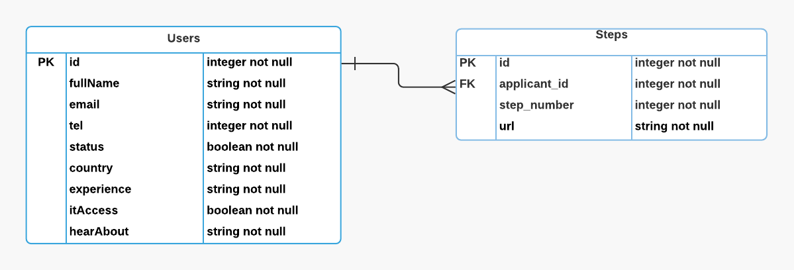

# application-process
# Code Your Future – Application Process

### Little bit about the project
This application has been developed to improve the existing application process of Code Your Future’s Coding Courses.  It aims to serve as an effective tool between potential students and Code Your Future for eased communication and interaction. This platform will allow users/applicants to manage and track the progress of their applications through the application steps. Applicants will be able to submit relevant materials at each step - links mainly. 
Admin(s) will be able to manage applications, and authorise progression to the next step of the application process. 
 It will guide potential students with the information regarding the coding course and with step by step guidance on how to enrol to it. 
This application has been developed for mainly two types of users

**Applicants/Students** – They will get the necessary info reg the course, how to enrol to it and go into a smooth step by step application process should they decided to go ahead.

**Code Your Future Admission Team** – They will be able to provide all the imformation to the potential student so applicants can know what they are getting into. They will also be able to track applicants’ application process and will be able to guide them along the way.

## Database Schema

## Team Members

###  Olena 
### Prabesh
### Louis

## Mentor

### Gerald 
Gerald will be guiding the team throughout the process and will help the team achieve the goal with his expertise.

## Technologies used
### Front-end: - HTML, CSS, SASS, Bootstrap, JavaScript, React JS. 
### Back-end: - Node JS, Express, SQLite
